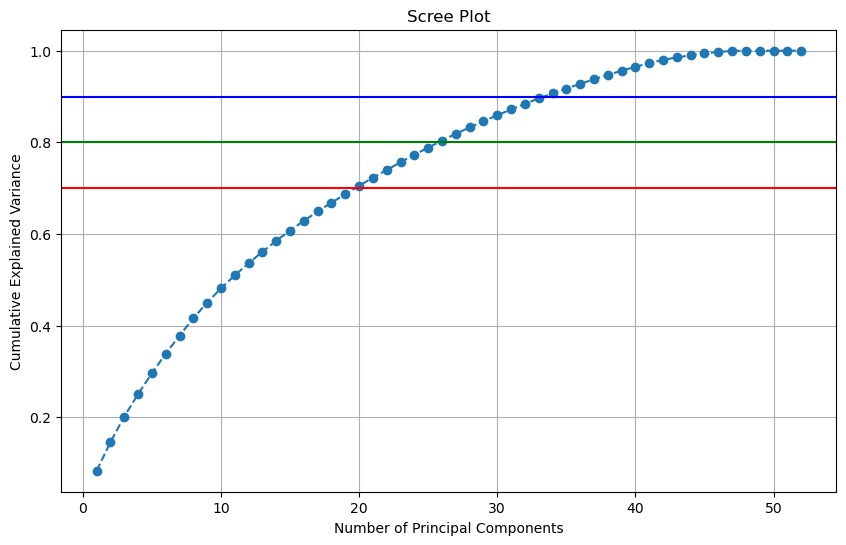

```{r, echo=FALSE, warning=FALSE, message=FALSE}
library(tidyverse)
library(dplyr)
library(ggplot2)
library(data.table)
library(kableExtra)
```

```{r, echo=FALSE}
merged_df <- fread("merged_df.csv")
merged_df$survival_time = as.numeric(difftime(merged_df$deathtime, merged_df$admittime, units = "day"))
```

**Aim**

-   Fit a model to predict in-hospital mortality among patients in the heart failure dataset.


**Research Questions**

-   What are the predictors of in-hospital mortality among ICU admitted heart failure patients? 

-   How do demographics, vital signs, comorbidities, and laboratory results influence the risk of            hospital mortality? 

-   How can we ensure the interpretability of our model  while also maintaining prediction accuracy? 

-   Which demographic factors, vital signs, comorbidities, and laboratory results are the most               significant  predictors of in-hospital mortality among ICU-admitted heart failure patients in the        MIMIC-III database?


### Variables

Top 10 features selected based on PCA loadings: gendera, Systolic blood pressure, Hyperlipemia, depression, Diastolic blood pressure, Platelets, PH, INR, PT, MCV. 




## EDA

```{r,echo=FALSE, warning=FALSE}
# Histograms for continuous variables
continuous_vars <- c('heart rate', 'Systolic blood pressure', 'Diastolic blood pressure', 'Respiratory rate', 'temperature', 'SP O2')

merged_df %>%
  select(all_of(continuous_vars)) %>%
  gather(key = "variable", value = "value") %>%
  ggplot(aes(x = value)) +
  geom_histogram(bins = 15, fill = "orange", color = "black") +
  facet_wrap(~variable, scales = "free") +
  theme_minimal() +
  labs(title = "Distribution of Continuous Variables", x = "Value", y = "Frequency")

```


# t-test  


```{r,results='hide'}
cont <- c("age", "BMI", "heart rate", "Systolic blood pressure", 
          "Diastolic blood pressure", "Respiratory rate", "temperature", "SP O2", 
          "Urine output", "hematocrit", "RBC", "MCH", "MCHC", "MCV", "RDW", 
          "Leucocyte", "Platelets", "Neutrophils", "Basophils", "Lymphocyte", 
          "PT", "INR", "NT-proBNP", "Creatine kinase", "Creatinine", 
          "Urea nitrogen", "glucose", "Blood potassium", "Blood sodium", 
          "Blood calcium", "Chloride", "Anion gap", "Magnesium ion", "PH", 
          "Bicarbonate", "Lactic acid", "PCO2")

for (var in cont) {
  t_test <- t.test(merged_df[[var]] ~ merged_df$outcome, data = merged_df)
  print(paste("T-test for", var))
  print(t_test)
}
```


# chi-square test 

```{r, results='hide'}
cat <- c("gendera", "hypertensive", "atrialfibrillation", "CHD with no MI", 
         "diabetes", "deficiencyanemias", "depression", "Hyperlipemia", 
         "Renal failure", "COPD")

for (var in cat) {
  chi_sq <- chisq.test(table(merged_df[[var]], merged_df$outcome))
  print(paste("Chi-square test for", var))
  print(chi_sq)
}
```


```{r, results='hide'}
full_model <- glm(outcome ~ gendera + hypertensive + atrialfibrillation + 
                    `CHD with no MI` + diabetes + deficiencyanemias + depression 
                  + Hyperlipemia + `Renal failure` + 
            COPD + age + `heart rate` + BMI + `Systolic blood pressure` + 
            `Diastolic blood pressure` + `Respiratory rate` + temperature + 
            `SP O2` + `Urine output` + hematocrit + RBC + MCH + MCHC + MCV + 
            RDW + Leucocyte + Platelets + Neutrophils + Basophils + Lymphocyte + 
            PT + INR + `NT-proBNP` + `Creatine kinase` + Creatinine + 
              `Urea nitrogen` + glucose + `Blood potassium` + `Blood sodium` + 
              `Blood calcium` +  Chloride + `Anion gap` + `Magnesium ion` + PH 
            + Bicarbonate + `Lactic acid` + PCO2, 
            data = merged_df, family = "binomial")
summary(full_model)
```

```{r}
#current_aic <- AIC(full_model)
#while (TRUE) {
#    current_aic <- AIC(full_model)
#    reduced_model <- step(full_model, direction = "backward")
#    reduced_aic <- AIC(reduced_model)
#    if (reduced_aic > current_aic) break
#    full_model <- reduced_model
#}
#summary(full_model)
```


```{r, echo=FALSE}
#Total of each patients' comorbidity score - comorb_score
merged_df$comorb_score = merged_df$gendera + merged_df$hypertensive + merged_df$atrialfibrillation + merged_df$`CHD with no MI` + merged_df$diabetes + merged_df$deficiencyanemias + merged_df$depression + merged_df$Hyperlipemia + merged_df$`Renal failure` + merged_df$COPD

#Length of stay for survivors - LOS
merged_df$LOS = as.numeric(difftime(merged_df$dischtime, merged_df$admittime, units = "days")) * !merged_df$outcome
merged_df$LOS = ifelse(!merged_df$outcome, as.numeric(difftime(merged_df$dischtime, merged_df$admittime, units = "days")), NA)

#total length of stay for those who both survived (discharged) and died - tLOS
merged_df$tLOS <- ifelse(is.na(merged_df$LOS), merged_df$survival_time, merged_df$LOS)

```


```{r, echo=FALSE}
merged_df %>%
  mutate(outcome = recode(factor(outcome), `0` = "Survived", `1` = "Died")) %>%
  group_by(factor(outcome)) %>%
  summarise(sys_bp = mean(`Systolic blood pressure`, na.rm = TRUE), 
            dia_bp = mean(`Diastolic blood pressure`, na.rm = TRUE),
            platelets = mean(Platelets),
            p_h = mean(PH, na.rm = TRUE),
            i_n_r = mean(INR, na.rm = TRUE),
            p_t = mean(PT, na.rm = TRUE),
            m_c_v = mean(MCV)) %>%
  rename(
    Outcome = `factor(outcome)`,
    `Systolic BP (mmHg)` = sys_bp,
    `Diastolic BP (mmHg)` = dia_bp,
    `Platelets ($10^9$/L)` = platelets,
    `pH` = p_h,
    `INR` = i_n_r,
    `PT (s)` = p_t,
    `MCV (fL)` = m_c_v
  ) %>%
    kable(digits = 2, caption = "Summary Statistics by Outcome")
```


**Next step**

-   To develop a model, we plan to start with logistic regression and CARTs for a binary outcome.For         logistic regression we will check for multicollinearity using VIF. We intend to include interaction      terms, polynomial features or scaling variables to better capture patterns in the data.  

-   Advanced models like random forest, cox proportional hazards with time varying coefficients, random      survival forests, hazard function, cumulative hazard function, survival function will be implemented     later with the addition of the death time variable. 

-   For survival analysis, to evaluate the model we plan to use metrics like C-index.


